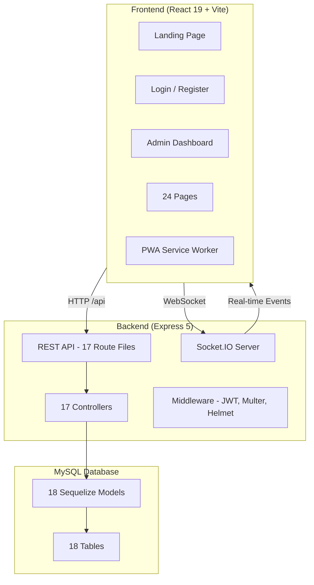
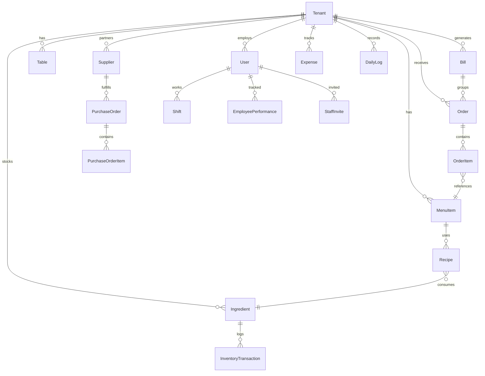

# DINE-EASE — Project Report

> **Full-Stack Restaurant Management & Digital Ordering Platform**
> Built with React 19, Express 5, MySQL, Socket.IO, and PWA

---

## 1. Project Overview

**DINE-EASE** is a comprehensive, multi-tenant restaurant management platform that digitizes every aspect of restaurant operations — from menu management and order processing to billing, inventory tracking, staff coordination, and customer-facing QR ordering.

The platform supports three user classes:
- **Restaurant Owners/Admins** — Full control over all operations
- **Staff (Chefs, Waiters, Managers)** — Role-specific portals
- **Customers** — Mobile QR-based menu browsing and ordering

---

## 2. Technology Stack

### Frontend
| Technology | Version | Purpose |
|-----------|---------|---------|
| React | 19.2.4 | UI framework (SPA) |
| Vite | 5.4.0 | Build tool & dev server |
| React Router | 7.13.1 | Client-side routing |
| Axios | 1.13.6 | HTTP client |
| Socket.IO Client | 4.8.3 | Real-time WebSocket communication |
| Framer Motion | 12.38.0 | Page transitions & animations |
| Anime.js | 3.2.2 | Micro-animations |
| Recharts | 3.8.0 | Data visualization charts |
| QRCode.react | 4.2.0 | QR code generation |
| React Hot Toast | 2.6.0 | Toast notifications |

### Backend
| Technology | Version | Purpose |
|-----------|---------|---------|
| Express | 5.2.1 | REST API framework |
| Sequelize | 6.37.8 | MySQL ORM |
| MySQL2 | 3.19.1 | Database driver |
| Socket.IO | 4.8.3 | Real-time event broadcasting |
| JWT | 9.0.3 | Authentication tokens |
| bcryptjs | 3.0.3 | Password hashing |
| Multer | 2.1.1 | File upload handling |
| Helmet | 8.1.0 | Security headers |
| CORS | 2.8.6 | Cross-origin resource sharing |

---

## 3. System Architecture



### Multi-Tenant Architecture
Every data record is scoped by `tenant_id`, ensuring complete data isolation between restaurants. A single deployment serves multiple restaurants simultaneously.

---

## 4. Database Schema

### 18 Models



| # | Model | Key Fields | Purpose |
|---|-------|-----------|---------|
| 1 | **Tenant** | name, email, phone, address, currency | Restaurant entity |
| 2 | **User** | name, email, password, role, tenant_id | All user types |
| 3 | **MenuItem** | name, price, category, image_url, dietary_tags, is_special | Menu catalog |
| 4 | **Order** | table_number, status, total_amount, bill_id | Order lifecycle |
| 5 | **OrderItem** | order_id, menu_item_id, quantity, price | Line items |
| 6 | **Bill** | table_number, subtotal, tax, tip, discount, total, payment_status | Billing records |
| 7 | **Table** | table_number, capacity, status, qr_code | Table management |
| 8 | **Ingredient** | name, current_quantity, unit, low_stock_threshold | Inventory items |
| 9 | **InventoryTransaction** | ingredient_id, type, quantity, notes | Stock movement logs |
| 10 | **Recipe** | menu_item_id, ingredient_id, quantity_used | Recipe ↔ Inventory link |
| 11 | **Supplier** | name, contact_person, phone, email | Vendor management |
| 12 | **PurchaseOrder** | supplier_id, status, total | Procurement |
| 13 | **PurchaseOrderItem** | po_id, ingredient_id, quantity, unit_price | PO line items |
| 14 | **Expense** | category, amount, description, date | Operational costs |
| 15 | **Shift** | user_id, clock_in, clock_out, hours_worked | Time tracking |
| 16 | **EmployeePerformance** | user_id, order_count, avg_seconds | Staff metrics |
| 17 | **StaffInvite** | email, role, token, status | Invite-based onboarding |
| 18 | **DailyLog** | date, total_revenue, total_orders | Daily summaries |

---

## 5. API Architecture

### 17 Route Files → 17 Controllers

| Route Prefix | Controller | Key Endpoints |
|-------------|-----------|---------------|
| `/api/auth` | authController | POST /login, POST /register, GET /me |
| `/api/menu` | menuController | CRUD + image upload (multipart/form-data) |
| `/api/orders` | orderController | CRUD + status transitions |
| `/api/kitchen` | (orderController) | GET pending, PUT status updates |
| `/api/tables` | tableController | CRUD + QR code generation |
| `/api/billing` | billingController | Generate, update, pay, receipt |
| `/api/inventory` | inventoryController | CRUD + stock adjustments + transactions |
| `/api/suppliers` | supplierController | CRUD supplier records |
| `/api/po` | poController | Purchase order management |
| `/api/expenses` | expenseController | CRUD expense tracking |
| `/api/staff` | staffController | List staff, invite, manage |
| `/api/analytics` | analyticsController | Revenue, COGS, top items, heatmap |
| `/api/dashboard` | dashboardController | Real-time KPI stats with trends |
| `/api/performance` | performanceController | Employee metrics, shifts |
| `/api/tenant` | tenantController | Profile, settings, password change |
| `/api/superadmin` | superAdminController | Multi-tenant oversight |
| `/api/public` | publicController | Public menu & QR order submission |

### Real-Time WebSocket Events
| Event | Direction | Purpose |
|-------|-----------|---------|
| `join_tenant` | Client → Server | Join tenant room |
| `order_created` | Server → Client | New order notification |
| `order_updated` | Server → Client | Status change (preparing/ready/served) |
| `menu_updated` | Server → Client | Price or availability changes |
| `bill_created` | Server → Client | New bill generated |
| `bill_paid` | Server → Client | Payment recorded |
| `inventory_update` | Server → Client | Stock level changes |

---

## 6. Frontend Architecture

### 24 Pages

| # | Page | Route | Roles | Description |
|---|------|-------|-------|-------------|
| 1 | **Landing** | `/` | Public | Premium animated landing page with particle effects |
| 2 | **Login** | `/login` | Public | Admin/manager authentication |
| 3 | **Register** | `/register` | Public | New restaurant onboarding |
| 4 | **Staff Login** | `/staff-login` | Public | Chef/waiter authentication |
| 5 | **Staff Invite** | `/staff-invite/:token` | Public | Token-based staff registration |
| 6 | **Dashboard** | `/dashboard` | Admin, Manager | KPI cards with real-time day-over-day trends |
| 7 | **Menu** | `/menu` | Admin, Manager | Full CRUD with image upload, dietary tags, specials |
| 8 | **Orders** | `/orders` | Admin, Manager | Order lifecycle management with real-time updates |
| 9 | **Kitchen** | `/kitchen` | Admin, Manager, Chef | Real-time order queue with ticket cards |
| 10 | **Waiter** | `/waiter` | Waiter | Table-based order taking interface |
| 11 | **Tables** | `/tables` | Admin, Manager | Visual table grid + QR code generation |
| 12 | **Billing** | `/billing` | Admin, Manager, Waiter | Bill generation, tax/tip/discount, payment recording |
| 13 | **Inventory** | `/inventory` | Admin, Manager | Stock tracking, adjustments, low-stock alerts |
| 14 | **Suppliers** | `/suppliers` | Admin, Manager | Vendor management |
| 15 | **Purchase Orders** | `/pos` | Admin, Manager | Procurement workflow |
| 16 | **Expenses** | `/expenses` | Admin, Manager | Operational cost tracking |
| 17 | **Analytics** | `/analytics` | Admin, Manager | Revenue charts, heatmap, top items, COGS analysis |
| 18 | **Staff** | `/staff` | Admin | Staff management with invite system |
| 19 | **Staff Scheduling** | `/staff/scheduling` | Admin, Manager | Shift management and calendar |
| 20 | **Employee Portal** | `/employee-portal` | All Staff | Personal stats, clock in/out, shift history |
| 21 | **Settings** | `/settings` | Admin | Profile, security, notifications, integrations |
| 22 | **Super Admin** | `/superadmin` | Super Admin | Multi-tenant oversight dashboard |
| 23 | **Customer Menu** | `/m/:tenantId/:tableId` | Public | Mobile QR ordering portal |
| 24 | **404 Not Found** | `*` | Public | Premium animated error page |

### 9 Shared Components

| Component | Purpose |
|-----------|---------|
| **Sidebar** | Navigation with role-based links + theme toggle |
| **Layout** | Sidebar + content wrapper |
| **Navbar** | Top navigation bar |
| **ProtectedRoute** | JWT + role-based route guard |
| **ErrorBoundary** | React error crash recovery |
| **InventoryAlerts** | Low-stock notifications |
| **ParticlesBackground** | Canvas particle animation |
| **SpiralBackground** | Animated spiral visual effect |
| **icons** | 30+ custom SVG icon components |

### 2 Context Providers
| Context | Purpose |
|---------|---------|
| **AuthContext** | User state, JWT tokens, login/logout, currency |
| **ThemeContext** | Dark/light mode with localStorage persistence |

### 2 Utility Modules
| Utility | Purpose |
|---------|---------|
| **exportUtils** | CSV download, PDF report generation (analytics + billing) |
| **money** | Multi-currency formatting (INR, USD, EUR, GBP) |

### 27 CSS Stylesheets
Every page has a dedicated stylesheet with the premium dark-theme design system. Total CSS: **~170KB** of hand-crafted styles.

---

## 7. Feature Inventory

### 🔐 Authentication & Authorization
- JWT-based authentication with token refresh
- Role-based access control (admin, manager, chef, waiter, superadmin)
- Staff invite system with unique tokenized links
- Separate login flows for admin vs staff
- Password hashing with bcryptjs
- 401 auto-redirect with role-aware routing

### 🍽️ Menu Management
- Full CRUD for menu items
- Image upload via Multer (JPEG/PNG/WebP, max 5MB)
- Categories, dietary tags (Vegan, Gluten-Free, Spicy, etc.)
- Chef's Special highlighting
- Availability toggle
- Real-time WebSocket sync — price changes reflect instantly across all portals

### 📋 Order Processing
- Complete order lifecycle: **Pending → Preparing → Ready → Served → Billed**
- Real-time kitchen display with ticket cards
- Waiter portal for table-based ordering
- Customer QR portal for self-service ordering
- Socket-based instant notifications across all connected clients

### 🧾 Billing & Payments
- Automatic bill generation from served orders
- Configurable GST tax rates (5%, 12%, 18%)
- Tip and discount management
- Multiple payment methods (Cash, Card, UPI, Split)
- Printable thermal-style receipts
- Bill history with CSV and PDF export

### 📊 Analytics & Reporting
- Revenue trend charts with configurable time ranges (7D/30D/90D)
- Top-selling items leaderboard
- 24-hour sales intensity heatmap
- COGS (Cost of Goods Sold) analysis
- Labor cost tracking
- Net profit calculation
- Staff performance metrics
- CSV and PDF export for all reports

### 📦 Inventory Management
- Ingredient tracking with stock levels
- Low-stock threshold alerts (real-time notifications)
- Stock adjustment with transaction logging
- Recipe linking (menu item ↔ ingredients with quantities)
- Inventory transaction history

### 🏪 Supply Chain
- Supplier management (contacts, addresses)
- Purchase order workflow (draft → submitted → received)
- PO line items with ingredient linking
- Automated stock updates on PO receipt

### 💰 Expense Tracking
- Categorized expense logging
- Date-based filtering
- Integration with analytics for profit calculations

### 👥 Staff Management
- Email-based invite system with role assignment
- Staff scheduling with shift management
- Clock in/out tracking
- Employee portal with personal performance stats
- Hours worked calculation

### 🪑 Table Management
- Visual table grid with status indicators (available/occupied/reserved)
- QR code generation per table
- Capacity tracking
- Automatic status updates on order events

### 📱 Customer QR Ordering (PWA)
- Mobile-first responsive design
- Splash screen with restaurant branding
- Category-filtered menu browsing
- Shopping cart with quantity management
- One-tap order submission to kitchen
- PWA installable — "Add to Home Screen" support
- Offline-capable via service worker

### 🎨 UI/UX Design
- Premium dark theme with glassmorphism
- Light mode toggle (persistent)
- Custom SVG icon library (30+ icons)
- Smooth page transitions (Framer Motion)
- Micro-animations (Anime.js)
- Animated landing page with particle effects
- Fully responsive across all breakpoints
- Custom scrollbar styling

### 🛡️ Error Handling
- React Error Boundary with crash recovery UI
- Premium animated 404 page
- Toast notification system
- Form validation with inline errors

---

## 8. Development Phases

### Phase 1: Core Foundation
- Project scaffolding (Vite + Express)
- Database schema and Sequelize models
- Authentication system (JWT + bcrypt)
- Menu, Orders, Tables CRUD
- Kitchen display and Waiter portal
- Basic dashboard

### Phase 2: Advanced Features
- Billing with tax/tip/receipts
- Inventory and recipe management
- Supplier and purchase order workflow
- Expense tracking
- Analytics dashboard with charts
- Staff scheduling and employee portal
- Customer QR ordering portal
- Landing page with animations
- Real-time WebSocket updates

### Phase 3: Polish
- Dashboard real-time day-over-day trends
- Settings page wiring (profile, password, notifications)
- Menu image upload via Multer
- 404 page and Error Boundary
- Indian menu data seeding (49 items)

### Phase 4: Final Enhancements
- PDF/CSV export for analytics and billing
- Dark/Light mode toggle with persistence
- PWA support (manifest, service worker, meta tags)

---

## 9. File Statistics

| Category | Count |
|----------|-------|
| Frontend Pages | 24 |
| Shared Components | 9 |
| CSS Stylesheets | 27 |
| Context Providers | 2 |
| Utility Modules | 2 |
| Backend Controllers | 17 |
| Backend Route Files | 17 |
| Database Models | 18 |
| Backend Middleware | 3 (JWT, Multer, Helmet) |
| Seed Scripts | 3 |
| **Total Source Files** | **~120+** |

---

## 10. How to Run

### Prerequisites
- Node.js 18+
- MySQL 8.0+

### Backend
```bash
cd backend
npm install
# Configure .env (DB_HOST, DB_USER, DB_PASS, DB_NAME, JWT_SECRET)
npm run dev        # Starts on port 5000
```

### Frontend
```bash
cd frontend
npm install
npm run dev        # Starts on port 5173 with proxy to backend
```

### Access Points
| URL | Purpose |
|-----|---------|
| `http://localhost:5173` | Landing page |
| `http://localhost:5173/login` | Admin login |
| `http://localhost:5173/staff-login` | Staff login |
| `http://localhost:5173/m/:tenantId/:tableId` | Customer QR menu |
| `http://localhost:5173/dashboard` | Admin dashboard |

---

## 11. Security Measures

- **JWT Authentication** — Stateless token-based auth with expiry
- **bcryptjs** — Password hashing (salted)
- **Helmet** — HTTP security headers
- **CORS** — Configured origin restrictions
- **Role-based Guards** — Frontend + backend authorization
- **Input Validation** — express-validator on critical endpoints
- **SQL Injection Prevention** — Sequelize parameterized queries
- **File Upload Validation** — Type and size restrictions via Multer

---

> **DINE-EASE** — From scan to serve, every interaction is digital, real-time, and delightful. 🍽️
